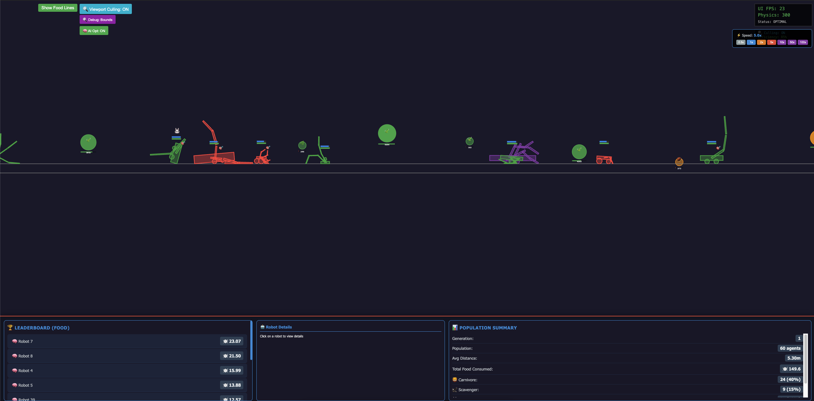

# Walker - An Autonomous AI Simulation

A 2D physics-based simulation for training autonomous agents using reinforcement learning and evolutionary algorithms.

🚀 **Live Demo**: [https://mlapi.us/walker/](https://mlapi.us/walker/)



## Core Features

*   **Physics-Based Simulation**: 2D environment powered by Box2D.
*   **Reinforcement Learning**: Features an Attention-based Deep Q-Learning model for agent decision-making.
*   **Evolutionary Algorithms**: Agent morphology (body structure) evolves over generations.
*   **Dynamic Environments**: The world is procedurally generated with changing terrain, obstacles, and resources.
*   **Efficient Agent Recycling**: A memory pool reuses agents to preserve learned knowledge.
*   **Web-Based Visualization**: Live monitoring and interaction via a Flask and Socket.IO interface.

## Getting Started

### Prerequisites
- Docker
- Docker Compose

### Installation & Running

1.  **Clone the repository:**
    ```bash
    git clone https://github.com/alecKarfonta/Walker.git
    cd Walker
    ```

2.  **Build and run the Docker container:**
    ```bash
    docker compose up -d --build
    ```

3.  **Access the web interface:**
    Open your browser and navigate to `http://localhost:8080`.

## Project Structure

```
.
├── src/                 # Main source code for the simulation
├── scripts/             # Utility, analysis, and standalone scripts
├── docs/                # Project documentation and reports
├── config/              # Simulation and environment configuration
├── tests/               # Unit and integration tests
├── docker-compose.yml   # Docker Compose configuration
└── train_robots_web_visual.py # Main entry point for the simulation
```
