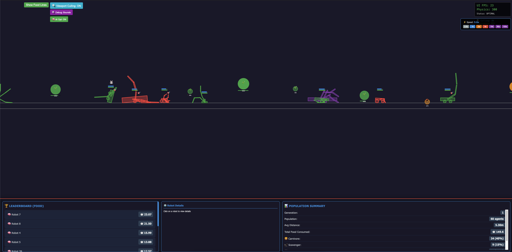

# Walker Python

A simulated environment for training populations of walking robots using reinforcement learning and evolutionary algorithms.

🚀 **[Live Demo](https://mlapi.us/walker/)** - See the simulation in action!



## Features

- **Physics Simulation**: Realistic 2D physics using Box2d
- **Reinforcement Learning**: Various implementations of Q-Learning with neural networks
- **Evolutionary Algorithm**: Population-based evolution with genetic operators
- **Real-time Visualization**: Pygame-based rendering with interactive debugging
- **Web Interface**: Browser-based visualization and control panel
- **Interactive GUI**: Parameter adjustment and simulation control
- **Performance Monitoring**: Real-time statistics and leaderboards

## What is Walker?

Walker is a machine learning simulation where populations of robots learn to walk through a combination of:
- **Reinforcement Learning**: Individual robots learn through trial and error
- **Evolutionary Algorithms**: Successful traits are passed to future generations
- **Neural Networks**: Robots use neural networks to make movement decisions
- **Physics Simulation**: Realistic physics constraints make walking a challenging task

Watch as robots evolve from clumsy attempts to efficient walkers over many generations!

## Installation

1. Clone the repository:
```bash
git clone https://github.com/alecKarfonta/Walker
cd Walker
```

2. Build and run with Docker:
```bash
docker compose up -d --build
```

## Live Demo

Check out the live simulation running at: **https://mlapi.us/walker/**

Features available in the live demo:
- Real-time robot population visualization
- Performance leaderboards
- Individual robot details and statistics
- Speed controls (0.5x to 100x)
- Viewport culling and debug options

## Project Structure

```
walker_python/
├── src/
│   ├── config/          # Configuration and settings
│   ├── physics/         # Physics engine (Pymunk)
│   ├── agents/          # Reinforcement learning agents
│   ├── population/      # Population management
│   ├── rendering/       # Graphics and visualization
│   ├── ui/             # User interface
│   ├── utils/          # Utility functions
│   └── assets/         # Game assets
├── tests/              # Unit tests
├── requirements.txt    # Python dependencies
└── run.py             # Main entry point
```
